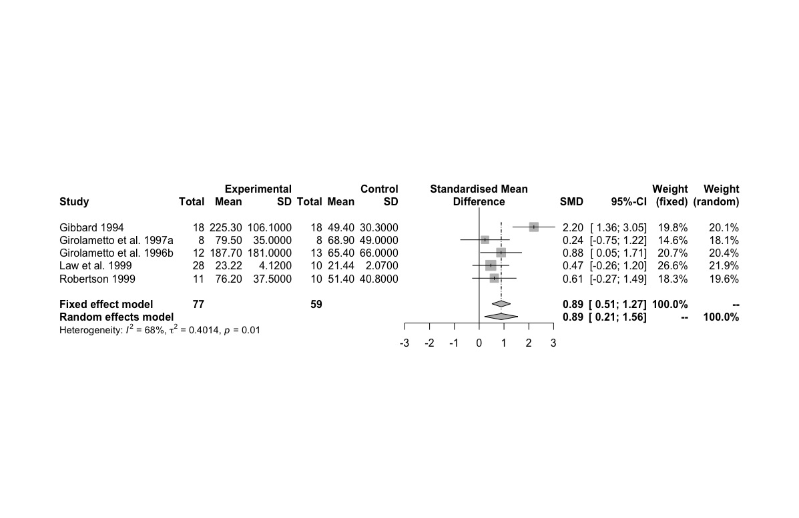

# meta_example

### The challenge
Provide my students with a tool for creating forest plots, funnel plots and other elements of meta-analysis in two sessions. 

### The background 
Most students were gearing up to do a meta-analysis for the first time based on a clinical question of interest to them. They'd previously had an introductory lecture on meta-analsis but none had any experience with R. 

### The response
Two descriptive R scripts that can be used by those with no previous experience with R. The first, `analysis/basic_operations.R`, is a gentle, hands-on introduction to some basic concepts in R, such as creating and manipulating objects. The other, `analysis/meta-analysis-example.R`, introduces some basic functions of the wonderful and easy-to-use `meta` package (Schwarzer, 2007). 

Both scripts can be dowloaded from the `analysis` folder above. The data file used in the meta-analysis example can be downloaded from the `analysis/data` folder. There are also two short documents in the `handouts` folder: (1) instructions for downloading and installing R and RStudio and (2) some resources for doing meta-analysis with R. Hope you find them useful. One of the forest plots from the second R script can be seen below.

#### My experience of "learning" R
My original motivation for learning R was not to do statistical analysis but to produce beautiful graphs. Having learned SPSS as an undergraduate, I'd been using it ever since--and never liked its graphs aesthetically. When I learned that the graphs I'd seen were produced with R and its `ggplot2` package (Wickham, 2016), I never looked back. 

The lesson here is to approach R with a specific purpose in mind, such as *How can I make a graph like that?* or *What can I use to do a meta-analysis and make a good-looking forest plot?* Much better to learn R this way that by asking too broad a question like, *How do I learn R?* When it came time for me to teach my students how to do a meta-analysis, I decided the best tool for the job was R and its `meta` package. You can gradually "learn R" by approaching it one task at a time if your experience is anything like mine.     

